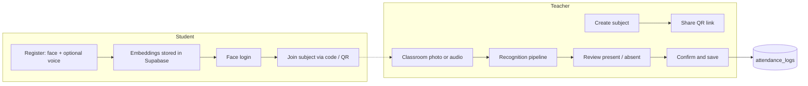
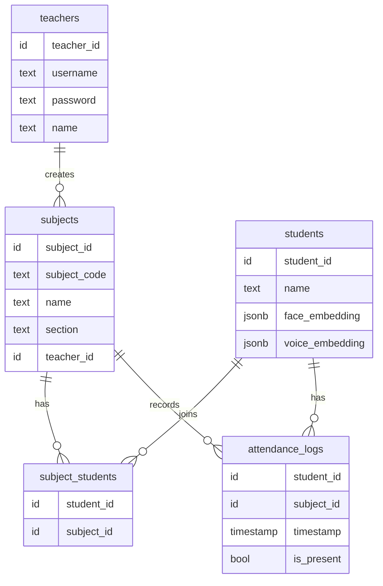
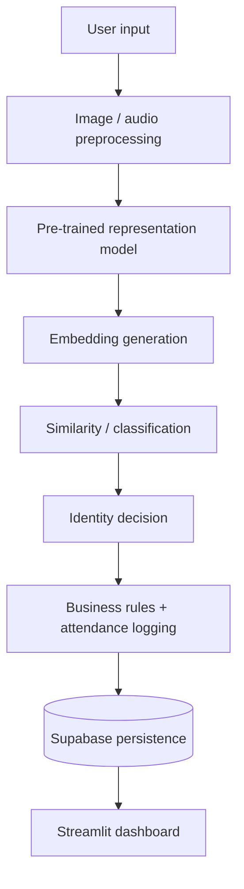

<div align="center">

# 🎓 AttendAI

### Multimodal AI Attendance System — Face + Voice Recognition

Automate classroom attendance with **face embeddings**, **speaker embeddings**, and a clean **Streamlit** interface backed by **Supabase**.


</div>

---

## 📑 Table of Contents

- [Overview](#-overview)
- [Features](#-features)
- [How It Works](#-how-it-works)
- [AI / ML Pipeline](#-ai--ml-pipeline)
- [Project Structure](#-project-structure)
- [Getting Started (Windows)](#-getting-started-windows)
- [Supabase Schema](#-supabase-schema)
- [Testing Checklist](#-testing-checklist)
- [Limitations](#-limitations)
- [Resume Summary](#-resume-summary)
- [License](#-license)

---

## 🔎 Overview

AttendAI is a classroom attendance platform that identifies students from **photos** and **audio recordings**. It ships with separate **student** and **teacher** portals, QR-based subject enrollment, and full attendance history.

| | |
|---|---|
| **Frontend** | Streamlit |
| **Face model** | dlib `face_recognition_model_v1` (128-D embeddings) + linear SVM |
| **Voice model** | Resemblyzer `VoiceEncoder` |
| **Database** | Supabase |
| **Auth** | bcrypt-hashed teacher passwords |
| **Enrollment** | Subject code or QR link (`segno`) |

---

## ✨ Features

### 👩‍🎓 Student Portal
- Register with a name, face image, and optional voice sample
- Face login via camera
- Join subjects using a **subject code** or **QR link**
- View personal attendance history

### 👨‍🏫 Teacher Portal
- Secure account creation and login
- Create subjects and share **QR enrollment links**
- Capture or upload classroom photos
- Face analysis produces a **present / absent review table**
- Alternative: analyze a **classroom audio recording** with voice embeddings
- Review, confirm, then save attendance to Supabase

---

## 🧭 How It Works



---

## 🧠 AI / ML Pipeline

### Face Recognition

```text
image → dlib face detector → 128-D embedding → linear SVM → distance threshold → student ID
```

📄 `src/pipelines/face_pipeline.py`

| Component | Detail |
|---|---|
| Detector | `dlib.get_frontal_face_detector()` |
| Landmarks | `pose_predictor_5_face_landmarks.dat` via `face_recognition_models` |
| Descriptor | dlib `face_recognition_model_v1` |
| Classifier | `SVC(kernel="linear", probability=True, class_weight="balanced")` |
| Acceptance rule | Euclidean embedding distance **≤ 0.6** |
| Caching | `st.cache_resource` for dlib models and trained classifier |

### Voice Recognition

```text
audio → 16 kHz load → segmentation → Resemblyzer embedding → similarity match → student ID
```

📄 `src/pipelines/voice_pipeline.py`

| Component | Detail |
|---|---|
| Audio loading | `librosa` (resampled to 16 kHz) |
| Embedding model | Resemblyzer `VoiceEncoder` (pre-trained) |
| Minimum segment | 0.5 s |
| Match threshold | **0.65** |
| Matching | Dot product against stored candidate embeddings |

---

## 🗂 Project Structure

```text
AttendAI/
├── app.py
├── requirements.txt
├── README.md
└── src/
    ├── components/
    │   ├── dialog_add_photo.py
    │   ├── dialog_attendance_results.py
    │   ├── dialog_auto_enroll.py
    │   ├── dialog_create_subject.py
    │   ├── dialog_enroll.py
    │   ├── dialog_share_subject.py
    │   ├── dialog_voice_attendance.py
    │   ├── footer.py
    │   ├── header.py
    │   └── subject_card.py
    ├── database/
    │   ├── config.py
    │   └── db.py
    ├── pipelines/
    │   ├── face_pipeline.py
    │   └── voice_pipeline.py
    ├── screens/
    │   ├── home_screen.py
    │   ├── student_screen.py
    │   └── teacher_screen.py
    └── ui/
        └── base_layout.py
```

---

## 🚀 Getting Started (Windows)

### Prerequisites

| Requirement | Version |
|---|---|
| OS | Windows 10 / 11 |
| Python | CPython **3.12.x** |
| Streamlit | 1.64.0 |
| NumPy | **1.26.4** (avoids NumPy 2.x issues with older voice/ML dependencies) |

> [!NOTE]
> `dlib-bin` 20.0.1 provides a prebuilt Windows wheel for CPython 3.12, so no local C++ build is needed for dlib.

### 1. Clean up bundled environments

Do **not** use the `venv/` or `node_modules/` folders from the ZIP, and never commit them.

```powershell
Remove-Item -Recurse -Force venv
Remove-Item -Recurse -Force node_modules
```

<details>
<summary>Using Command Prompt instead?</summary>

```bat
rmdir /s /q venv
rmdir /s /q node_modules
```

</details>

### 2. Create a fresh environment

```powershell
py -3.12 -m venv .venv
.\.venv\Scripts\Activate.ps1
python --version   # expect Python 3.12.x
```

### 3. Upgrade packaging tools

```powershell
python -m pip install --upgrade pip wheel
python -m pip install "setuptools<70"
```

### 4. Install dependencies

Example pinned `requirements.txt`:

```text
streamlit==1.64.0
numpy==1.26.4
pandas==2.2.3
scikit-learn==1.6.1
dlib-bin==20.0.1
setuptools<70
supabase>=2,<3
bcrypt>=4,<5
segno>=1.6,<2
pillow>=10,<12
librosa==0.10.2.post1
scipy==1.14.1
torch==2.4.1
```

```powershell
pip install -r requirements.txt
```

### 5. Install the face model package

```powershell
pip install git+https://github.com/ageitgey/face_recognition_models
```

### 6. Install voice dependencies

Resemblyzer depends on `webrtcvad`, which normally needs a C/C++ build on Windows. Use the precompiled wheel instead:

```powershell
pip install webrtcvad-wheels==2.0.14
pip install resemblyzer==0.1.4 --no-deps
```

### 7. Configure Supabase secrets

Create `.streamlit/secrets.toml`:

```toml
SUPABASE_URL = "https://YOUR-PROJECT.supabase.co"
SUPABASE_KEY = "YOUR-SUPABASE-KEY"
```

> [!WARNING]
> Never commit `secrets.toml`. Add `.streamlit/secrets.toml` to your `.gitignore`.

### 8. Run

```powershell
streamlit run app.py
```

---

## 🗄 Supabase Schema

The exact SQL schema is not included. The tables below are derived from the queries and inserts in `src/database/db.py`.



> [!TIP]
> `face_embedding` and `voice_embedding` fit naturally in `JSON` / `JSONB` columns.

---

## ✅ Testing Checklist

**Teacher**
- [ ] Register a teacher account and log in
- [ ] Create a subject
- [ ] Copy the subject code or QR link

**Student**
- [ ] Capture a clear face image and register a profile
- [ ] Optionally record a voice sample
- [ ] Enroll in the teacher's subject

**Attendance**
- [ ] Select the subject in the teacher portal
- [ ] Add one or more classroom images and run face analysis
- [ ] Review detected students, then confirm and save
- [ ] Test voice attendance with a clear recording where each student speaks long enough for segmentation

---

## ⚠️ Limitations

- **No liveness / anti-spoofing.** A camera photo is not equivalent to biometric authentication with presentation-attack protection.
- **Pre-trained representations.** Face matching trains only a small SVM on stored embeddings; voice uses a pre-trained Resemblyzer model. No deep network is trained end-to-end here.
- **Simple voice segmentation.** Voice attendance uses basic segmentation and best-match scoring, not full speaker diarization.
- **Human review required.** Attendance should always be checked in the confirmation step before saving.

---

## 📝 Resume Summary

**AttendAI — Multimodal AI Attendance System**
Built a Streamlit-based attendance platform using dlib face embeddings, a linear SVM classifier, and Resemblyzer voice embeddings to identify students from classroom images and audio; integrated Supabase for student/subject/attendance management and QR-based enrollment.

<details>
<summary>What this project demonstrates</summary>



Computer vision, speaker embeddings, classical ML classification, threshold-based inference, database integration, authentication, and an interactive app layer, all in one applied ML workflow.

</details>

---

## 📄 License

Add an appropriate license (for example MIT) before publishing this repository publicly.
